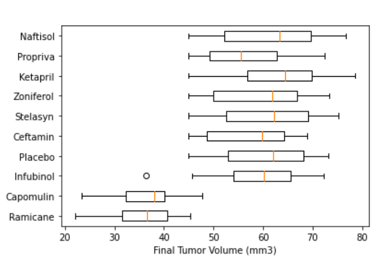

# Plotting With Matplotlib

You have been hired by Pymaceuticals Inc., one of the leading pharmaceutical companies that specializes in anti-cancer pharmaceuticals. In your role, you will assist the senior scientist team’s effort to screen potential treatments for squamous cell carcinoma (SCC), a commonly occurring form of skin cancer.

In this study, 249 mice identified with SCC tumor growth were treated through a variety of drug regimens. Over the course of 45 days, tumor development was observed and measured. The purpose of this study was to compare the performance of Pymaceuticals' drug of interest, Capomulin, with the other treatment regimens. You have been tasked by the senior scientist team to generate an initial drug regimen comparison and a summary of your findings. 

For this assignment, you will go through the steps of a basic data analysis and then visualize the dataset by using a new type of visualization: a **box and whisker plot**. Although we have provided all of the steps required to produce each output, there may be some new concepts and terminology in this assignment. If you are ever stuck or confused, search for the terms online and check out the resource links we provide throughout the activity. 

## Instructions

The instructions for this activity are broken down into three parts: 

1. Data Cleaning 

2. Data Analysis and Visualization 

3. Interpret Your Findings 

### Part 1: Data Cleaning
     
1. Load `Mouse_metadata.csv` and `Study_results.csv` from the `Resources` folder into the notebook. Then, using Pandas, display the top five rows of each DataFrame. 

2. Merge the two DataFrames and display the top five rows of the merged DataFrame.

    

3. At least one mouse has multiple entries for the same time point; this data must have been entered incorrectly, so data from these mice cannot be used. Find the rows with duplicate "Mouse ID" and "Timepoint." Optionally, you can create a DataFrame to view the duplicates.

      * **Hint:** Use the Pandas `.duplicated` method to identify which rows have duplicated in "Mouse ID" and "Timepoint" columns. 
      
      * Find the compromised Mouse IDs associated with these duplicate rows.

      * **Optional**: Display all data associated with compromised Mouse IDs.

4. Create a clean DataFrame by dropping any rows containing a compromised “Mouse ID”. 
      
      * **Hint:** Search for an example of filtering rows in Pandas using a list.

### Part 2: Data Analysis and Visualization

1. Create a `max_timepoint` DataFrame that has the greatest time point for each mouse.

    * **Hint:** Try using a Pandas `GroupBy` DataFrame and the `.max` method to determine the largest "Timepoint" for each "Mouse ID."
    
    * Reset the index of the Pandas DataFrame. 

       * **Hint:** Refer to the Pandas documentation for [resetting an index](https://pandas.pydata.org/pandas-docs/stable/reference/api/pandas.DataFrame.reset_index.html).

            
    
2. Join the newly created `max_timepoint` DataFrame with the cleaned DataFrame from Part 1 to create a new DataFrame `merged_data`. This DataFrame should contain all the columns from Part 1, but only the row with the maximum time point for each mouse.

      
      
3. Create a separate list of final tumor volumes for each drug regimen. Then store those lists in another list. 

    * Create a list with all 10 drug regimens.

    * Create an empty tumor volume list.
    
    * Using a `for` loop, iterate through the drug regimen list and filter the `merged_data` DataFrame to collect the final tumor volume data for each drug. 

      * **Hint:**: Use the Pandas `loc` method to filter your DataFrame by checking which of the current drugs is equal to the "Drug Regimen" column. Refer to [these examples of selecting and filtering  data by using `loc`](https://www.allthesnippets.com/browse/pandas/df_selection.html).

    * Append the tumor volume data from each drug regimen to the empty tumor volume list.
        
4. Create a box and whisker plot that visualizes the final tumor volume of all mice in the study by drug regimen.

    * Create a horizontal Matplotlib box and whisker plot by using the `plt.boxplot` method. 

      * **Note:** To make your box and whisker plot horizontal, use the `vert=False` argument. Refer to the Matplotlib [box and whisker plot documentation](https://matplotlib.org/api/_as_gen/matplotlib.pyplot.boxplot.html#matplotlib.pyplot.boxplot) for more information. 

    * Add a label to the x-axis. 
    
    * Show your plot in the notebook.

    * The final box and whisker plot should look like the following image, though the order of drugs may be different:

      

### Part 3: Interpret Your Findings

Now that you have created your first box and whisker plot, it's time to interpret your results. Review the following article about the different components of a box and whisker plot. Compare these components to the plot you just created, and consider the following questions. Don’t worry if you do not recognize all of the statistical measurements in the article; they will be covered in an upcoming module. 

[Towards Data Science: Understanding Box Plots](https://towardsdatascience.com/understanding-boxplots-5e2df7bcbd51)

**Note:** You do not need to write or submit any answers for these questions. The goal is to think critically about your results. 

1. What does the distribution of final tumor volumes look like for each regimen? Are there any drug regimens that look different from the other regimen results? 
    
2. What does it mean when a box of one drug regimen is smaller than another? Does that mean that data is missing? Why or why not?

### Grading Rubric

[Plotting with Matplotlib Rubric](Plotting_with_Matplotlib_Rubric.pdf)

---

© 2022 Trilogy Education Services, a 2U, Inc. brand. All Rights Reserved.

