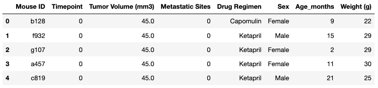
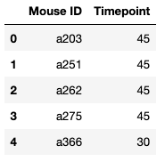
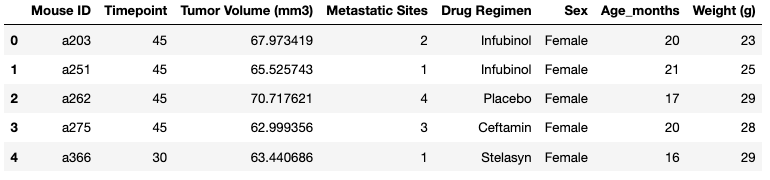

# Plotting With Matplotlib

I have been hired by Pymaceuticals Inc., one of the leading pharmaceutical companies that specializes in anti-cancer pharmaceuticals. My role: I will assist the senior scientist team’s effort to screen potential treatments for squamous cell carcinoma (SCC), a commonly occurring form of skin cancer.

In this study, 249 mice identified with SCC tumor growth were treated through a variety of drug regimens. Over the course of 45 days, tumor development was observed and measured. The purpose of this study was to compare the performance of Pymaceuticals' drug of interest, Capomulin, with the other treatment regimens. I have been tasked by the senior scientist team to generate an initial drug regimen comparison and a summary of my findings. 

I will go through the steps of a basic data analysis and then visualize the dataset by using a box and whisker plot. 

## Steps

The steps for this project are broken down into two parts: 

1. Data Cleaning 

2. Data Analysis and Visualization 

### Part 1: Data Cleaning
     
1. Loaded `Mouse_metadata.csv` and `Study_results.csv` from the `Resources` folder into the notebook. Then, using Pandas, displayed the top five rows of each DataFrame. 

2. Mergeded the two DataFrames and display the top five rows of the merged DataFrame.

    

3. At least one mouse has multiple entries for the same time point; this data must have been entered incorrectly, so data from these mice cannot be used. Found the rows with duplicate "Mouse ID" and "Timepoint." 
4. 
       Used the Pandas `.duplicated` method to identify which rows have duplicated in "Mouse ID" and "Timepoint" columns. 
      
       Found the compromised Mouse IDs associated with these duplicate rows.

       Displayed all data associated with compromised Mouse IDs.

4. Created a clean DataFrame by dropping any rows containing a compromised “Mouse ID”. 
      
     

### Part 2: Data Analysis and Visualization

1. Created a `max_timepoint` DataFrame that has the greatest time point for each mouse.

    
    * Reset the index of the Pandas DataFrame. 

     
            
    
2. Joined the newly created `max_timepoint` DataFrame with the cleaned DataFrame from Part 1 to create a new DataFrame `merged_data`. This DataFrame should contain all the columns from Part 1, but only the row with the maximum time point for each mouse.

      
      
3. Created a separate list of final tumor volumes for each drug regimen. Then stored those lists in another list. 

    * Created a list with all 10 drug regimens.

    * Created an empty tumor volume list.
    
    * Used a `for` loop, iterate through the drug regimen list and filtered the `merged_data` DataFrame to collect the final tumor volume data for each drug. 

    * Appended the tumor volume data from each drug regimen to the empty tumor volume list.
        
4. Created a box and whisker plot that visualizes the final tumor volume of all mice in the study by drug regimen.

    * Created a horizontal Matplotlib box and whisker plot by using the `plt.boxplot` method. 

    * Added a label to the x-axis. 
    
    * Showed my plot in the notebook.

